# Wisecow DevOps Project

## Project Overview

This project demonstrates containerization, Kubernetes deployment, CI/CD automation, monitoring scripts, and runtime security implementation for the Wisecow application.

---

## Prerequisites

Before running this project, ensure the following tools are installed on your system:

- Docker
- Kubernetes
- Minikube
- Kubectl
- Git
- Python 3
- Bash (or Git Bash for Windows)
- KubeArmor CLI (karmor)

---


# Repository Structure 

```markdown
wisecow-demo
│
├── wisecow-app
│   └── wisecow.sh
│
├── docker
│   └── Dockerfile
│
├── kubernetes
│   ├── deployment.yaml
│   ├── service.yaml
│   └── ingress.yaml
│
├── kubearmor
│   └── kubearmor-policy.yaml
│
├── scripts
│   ├── system_health.sh
│   └── app_health.py
│
├── Outputs
│   └── (All screenshots)
│
├── .github/workflows
│   └── ci-cd.yml
│
└── README.md
```

---

## Problem Statement 1: Containerization and Deployment

### Step 1 : Dockerization
- Created Dockerfile for Wisecow application
- Built Docker image
- Pushed image to DockerHub

## 1. Run the Application Locally 


Run the Wisecow application:
```bash
bash wisecow-app/wisecow.sh
```
Open the application in browser:
[http://localhost:4499
](url)

#### Browser Output


#### Curl Output


## 2. Build and Run Docker Container

### Build Docker Image

Build the Docker image locally:
```bash
docker build -t wisecow-app -f docker/Dockerfile .
```

Run the container:
```bash
docker run -d -p 4499:4499 wisecow-app
```

#### Running Container
Verify the container is running:

```bash
docker ps
```
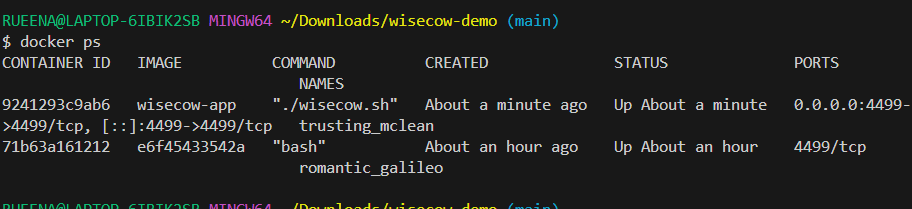

#### Docker Images


#### Docker Hub Repsitories
The Docker image was pushed to Docker Hub for remote access.

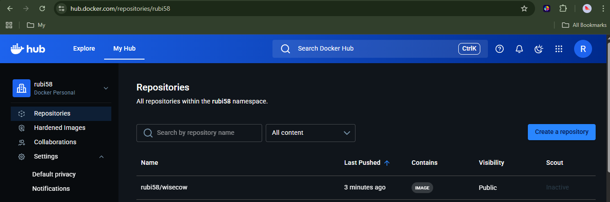


#### Docker Desktop Images


#### Login to docker hub 
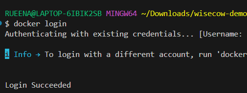

#### Docker Push 
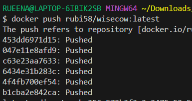

---

### Step 2 :  Kubernetes 
- Created Deployment YAML
- Exposed application using NodePort Service
- Configured Ingress for domain-based routing

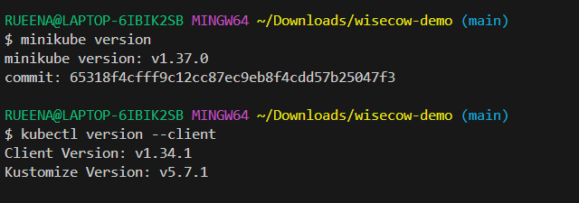

#### Apply Kubernetes manifests:


```bash 
kubectl apply -f kubernetes/deployment.yaml
kubectl apply -f kubernetes/service.yaml
kubectl apply -f kubernetes/ingress.yaml
```

#### Verify Reosurces
```bash
kubectl get pods
kubectl get svc
kubectl get ingress

```
### Kubernetes Deployment

#### Start Minikube

```bash

minikube start
```

#### Verify Cluster Is Running

```bash
kubectl get nodes
```


#### Apply Deployment 


#### Verify Resources


---

### Kubernetes Service


#### Access  the Application:
You can access the application using:

```bash
minikube service wisecow-service

```
Or using the NodePort IP:
http://<minikube-ip>:<nodeport>


#### Verify

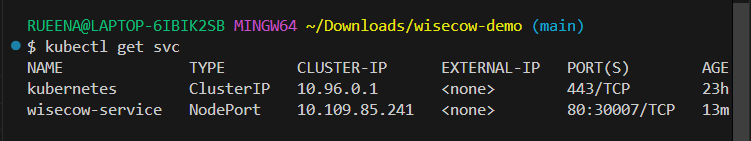


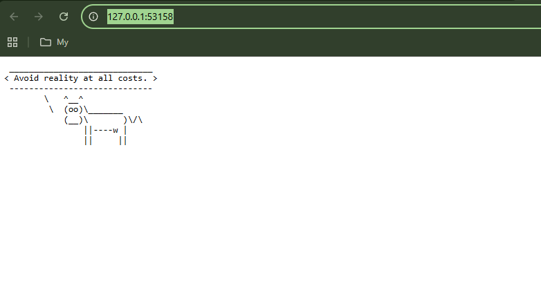

---

### Kubernetes Ingress 

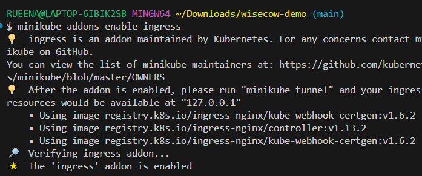

#### Verify Ingress Controller


#### Apply


---

### Step 3 : CI/CD Pipeline
- Implemented CI/CD using GitHub Actions
- Automatically builds and pushes Docker image on code changes


#### Github Actions Wisecow Application Ci/Cd Pipeline Run
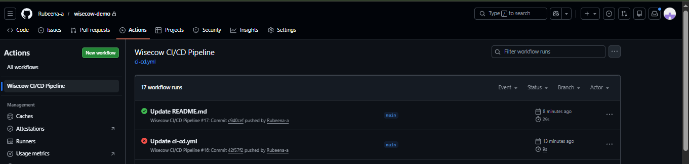


#### Github Actions Pipeline Steps Completed

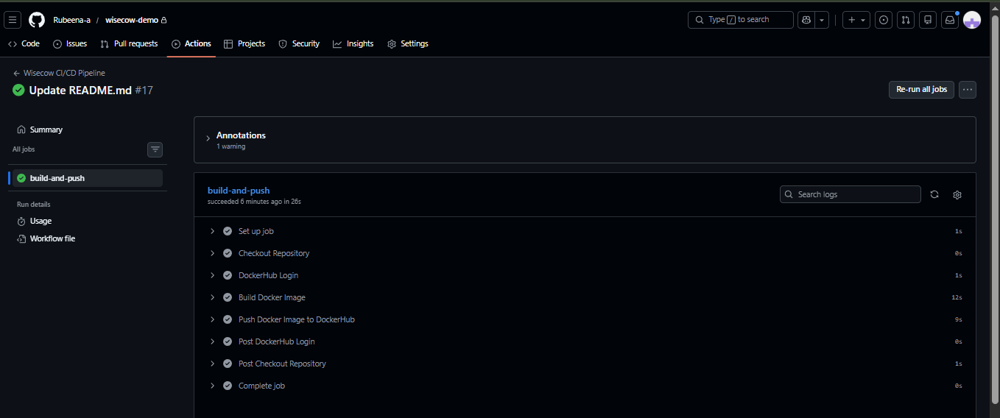


#### Github Action  Automatic Build And Push Docker Image In Docker Hub
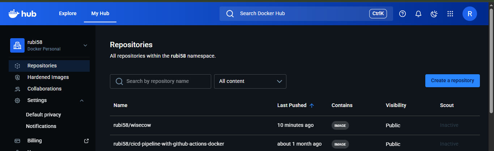


---

## Problem Statement 2: Monitoring and Automation

### System Health Monitoring Script
Monitors:
- CPU usage
- Memory usage
- Disk usage

### Run Monitoring Scripts

Run the script:

```bash
bash scripts/system_health_monitor.sh
```

#### When System Is On High CPU Usage

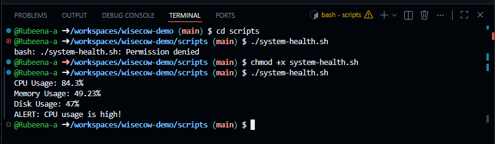

#### Normal System State

CPU, memory, and disk usage are below the alert threshold.

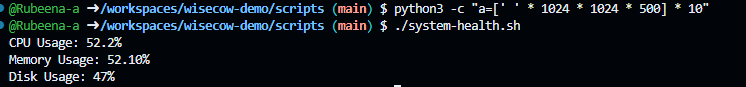

No alerts → system is healthy.


### Application Health Checker
This Python script verifies if the application is reachable.
Checks:
- Application availability
- HTTP status response

#### Run the script:

```bash
python scripts/app_health_checker.py
```


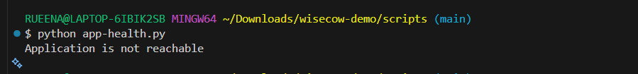

---

## Problem Statement 3: Runtime Security

### KubeArmor Implementation
- Installed KubeArmor
- Applied Zero Trust Security Policy
- Detected security violations inside container


```bash
$ ./karmor.exe version
karmor version 1.4.6 windows/amd64 BuildDate=2025-11-20T08:16:36Z
current version is the latest
```
## Security Testing with KubeArmor

KubeArmor is used to enforce runtime security policies inside containers.


#### Install KubeArmor in the Cluster 
Install KubeArmor:

```bash
./karmor.exe install
```
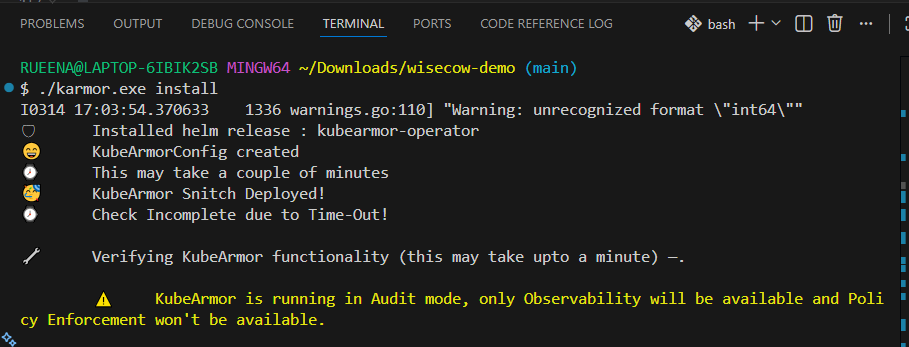

#### Kubectl Get Pods
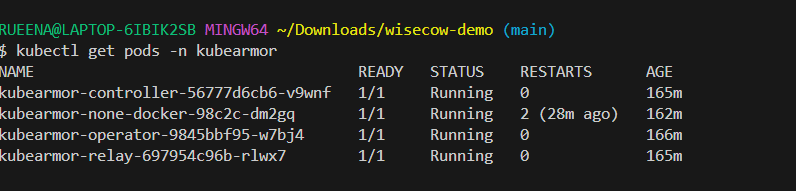

#### Confirm Wisecom is Still Running
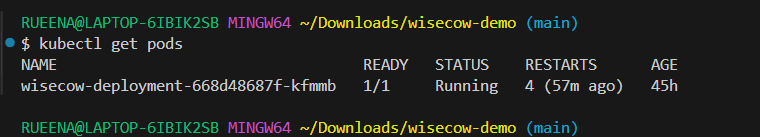


#### Apply Security Policy
Apply the security policy:
```bash
kubectl apply -f kubearmor/kubearmor-policy.yaml
```

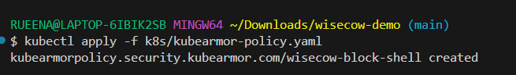


#### Verify Policy
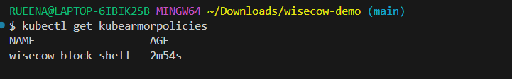


#### Apply Wisecow Block Sensitive File Policy

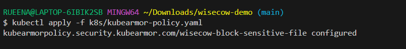


#### Verify Policy Exists and Pod Label

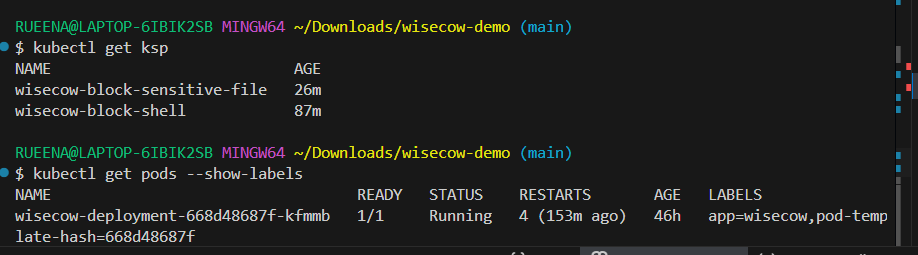


#### Monitoring Karmor Logs
Monitor security events:

```bash
karmor logs
```

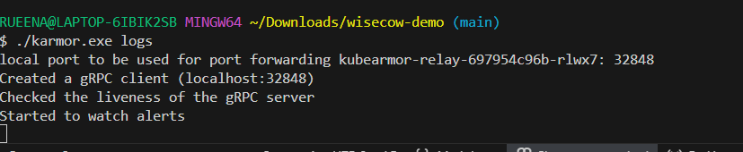


#### Wisecow-BLock-Passwd-Access-Policy-Created

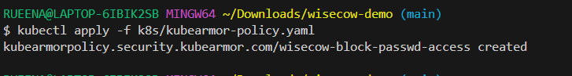


#### Policy Created and Policy Details

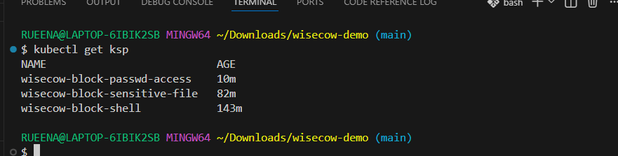


---


---

#  Project Architecture 

```markdown
## Project Architecture

The Wisecow DevOps project demonstrates a complete DevOps workflow:

1. The Wisecow shell application is containerized using Docker.
2. The container image is pushed to DockerHub.
3. Kubernetes deploys the container using Deployment and Service resources.
4. Ingress provides domain-based access to the application.
5. GitHub Actions automates the CI/CD pipeline.
6. Monitoring scripts track system and application health.
7. KubeArmor enforces runtime security policies inside containers.

```

## Technologies Used

- Docker
- Kubernetes
- GitHub Actions
- Bash scripting
- Python
- KubeArmor


## Future Improvements

- Integrate Prometheus and Grafana for advanced monitoring
- Implement Helm charts for Kubernetes deployments
- Add automated security scanning in CI/CD
- Deploy the application to a cloud Kubernetes cluster (EKS / GKE / AKS)


