# Cow wisdom web server

Wisecow DevOps Deployment

This project demonstrates containerization and deployment of the Wisecow application using Docker and Kubernetes.

Technologies Used:
- Docker
- Kubernetes
- GitHub Actions
- Bash / Python

Project Features:
- Dockerized Wisecow application
- Kubernetes deployment
- CI/CD pipeline using GitHub Actions
- System monitoring script
- Application health check script

##

## Application Output

### Running Container
```bash
docker ps
```


### Browser Output
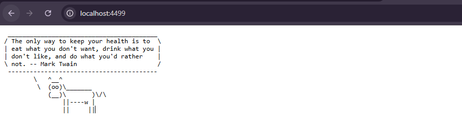

### Curl Output
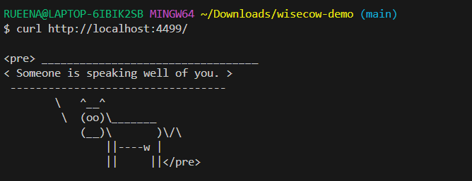

### Docker Image 

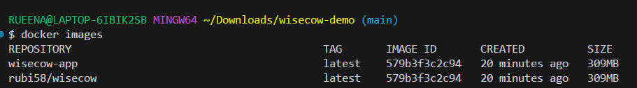

### Repsitories

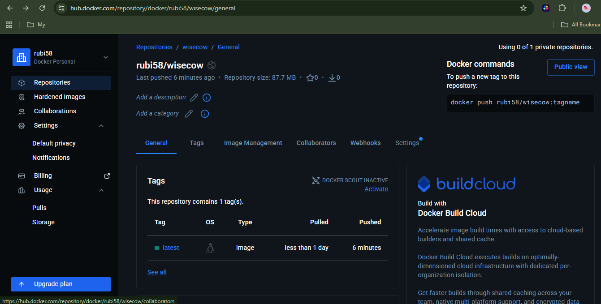

### Images
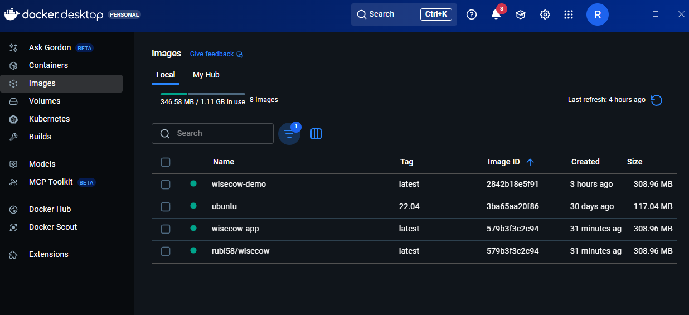

### Login to docker hub 


### Docker Push 


## Kubernetes Deployment


### Start Minikube

```bash

minikube start
```

### Verify Cluster Is Running

```bash
kubectl get nodes
```
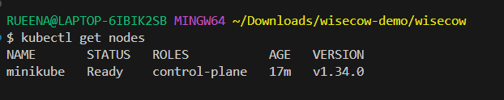


### Apply Deployment 


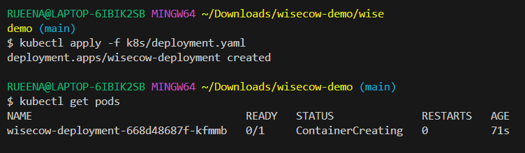


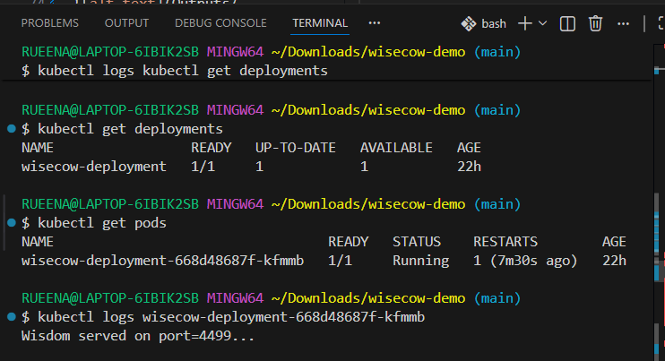

# Kubernetes Service

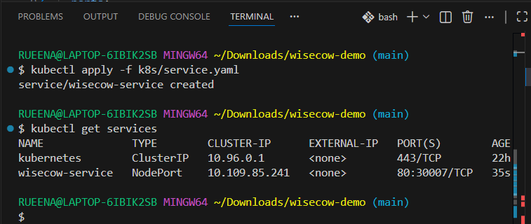

### Access  the Application:

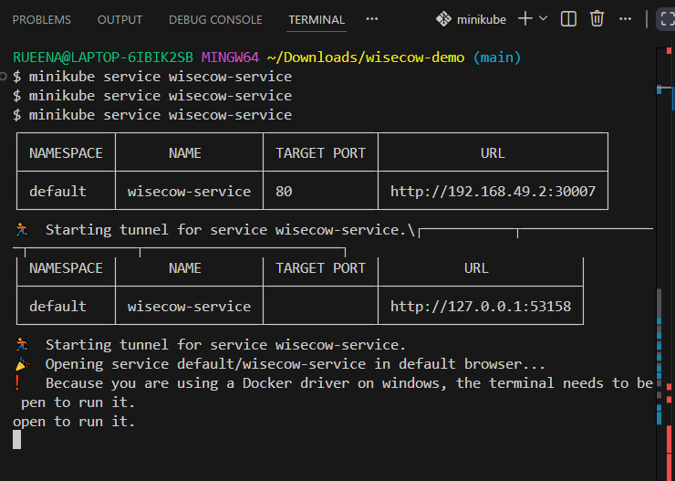

### Verify


### Verify Ingress Controller


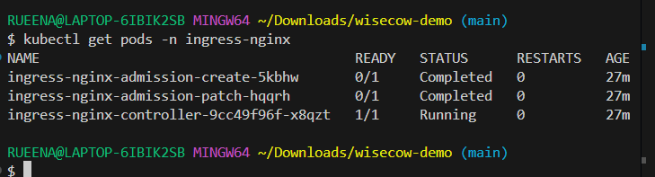


# Kubernetes Ingress

### Apply

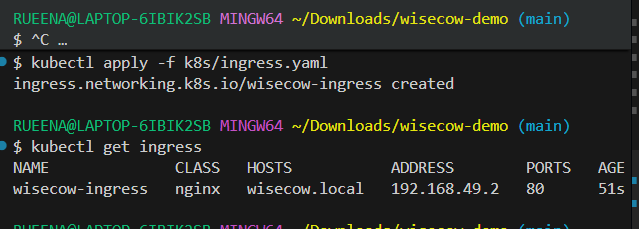
